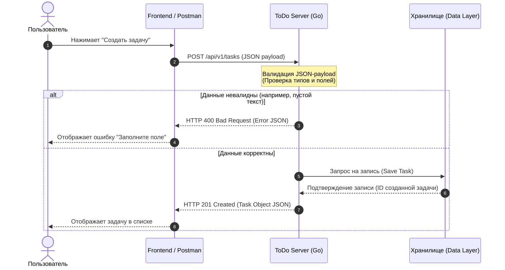

# ToDo Server — Веб-сервис «Планировщик задач»

Микросервис предназначен для управления персональными задачами пользователей (создание, просмотр, обновление статусов, удаление). Проект спроектирован с учетом требований к высокой отказоустойчивости, строгому соблюдению контрактов данных и минимизации времени отклика.

---

## 1. Бизнес-анализ и требования

### Бизнес-цель
Автоматизировать процесс трекинга личных задач пользователей, предоставив легковесный и быстрый инструмент для планирования, способный выдерживать высокие нагрузки на чтение и запись.

### Пользовательские сценарии (Use Cases)
* **UC-1: Создание задачи.** Пользователь передает текст задачи и дедлайн. Система валидирует входные данные, присваивает уникальный ID и сохраняет задачу со статусом "в процессе".
* **UC-2: Получение списка задач.** Пользователь запрашивает свои задачи. Система возвращает массив актуальных задач.
* **UC-3: Изменение статуса / Редактирование.** Пользователь может изменить текст или отметить задачу как "выполнено".
* **UC-4: Удаление задачи.** Пользователь удаляет задачу из системы по её ID.

---

## 2. Системная архитектура и потоки данных

Взаимодействие между клиентской частью (Frontend) и сервером (Backend) построено по стандарту **REST API**. Ниже представлена UML Sequence-диаграмма, описывающая сквозной процесс создания новой задачи с валидацией контракта.



---

## 3. Спецификация REST API (Интеграционные контракты)

Базовый URL: `/api/v1`

### 3.1. Создание задачи
* **URL:** `/tasks`
* **Метод:** `POST`
* **Headers:** `Content-Type: application/json`
* **Тело запроса (Request Body):**
```json
{
  "title": "Подготовить документацию для GitHub",
  "description": "Переписать README проекта ToDo Server под системный анализ",
  "due_date": "2026-10-15T18:00:00Z"
}
```
* **Успешный ответ (Response 201 Created):**
```json
{
  "id": 142,
  "title": "Подготовить документацию для GitHub",
  "description": "Переписать README проекта ToDo Server под системный анализ",
  "status": "new",
  "due_date": "2026-10-15T18:00:00Z",
  "created_at": "2026-10-07T10:30:00Z"
}
```
* **Обработка ошибок (Response 400 Bad Request):**
```json
{
  "error": "Bad Request",
  "message": "Поле 'title' является обязательным для заполнения"
}
```

### 3.2. Получение списка всех задач
* **URL:** `/tasks`
* **Метод:** `GET`
* **Успешный ответ (Response 200 OK):**
```json
[
  {
    "id": 142,
    "title": "Подготовить документацию для GitHub",
    "status": "new"
  }
]
```

---

## 4. Информационная модель (Структура данных)

Для обеспечения целостности данных в коде определена строгая структура сущности **Task**. 

| Поле | Тип данных | Обязательное (Required) | Описание |
| :--- | :--- | :--- | :--- |
| `id` | Integer / Int64 | Да (Генерируется системой) | Уникальный идентификатор задачи |
| `title` | String | Да (Min length: 1) | Заголовок/название задачи |
| `description`| String | Нет | Подробное описание |
| `status` | String | Да | Статус (`new`, `in_progress`, `completed`) |
| `due_date` | String (ISO 8601)| Нет | Срок выполнения (дедлайн) |

---

## 5. Техническая реализация (Стек)
* **Язык разработки:** Go (Golang) — обеспечивает высокую скорость обработки HTTP-запросов и минимальное потребление ресурсов.
* **Формат обмена данными:** JSON (с валидацией входящих структур).
