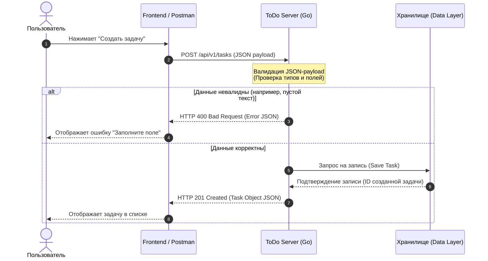

# ToDo Server — Веб-сервис «Планировщик задач»

Микросервис предназначен для управления персональными задачами пользователей (создание, просмотр, обновление статусов, удаление). Проект спроектирован с учетом требований к высокой отказоустойчивости, строгому соблюдению контрактов данных и минимизации времени отклика.

---

## 1. Бизнес-анализ и требования

### Бизнес-цель
Автоматизировать процесс трекинга личных задач пользователей, предоставив легковесный и быстрый инструмент для планирования, способный выдерживать высокие нагрузки на чтение и запись.

### Пользовательские сценарии (Use Cases)
* **UC-1: Создание задачи.** Пользователь передает текст задачи и дедлайн. Система валидирует входные данные, присваивает уникальный ID и сохраняет задачу со статусом "в процессе".
* **UC-2: Получение списка задач.** Пользователь запрашивает свои задачи. Система возвращает массив актуальных задач.
* **UC-3: Изменение статуса / Редактирование.** Пользователь может изменить текст или отметить задачу как "выполнено".
* **UC-4: Удаление задачи.** Пользователь удаляет задачу из системы по её ID.

---

## 2. Системная архитектура и потоки данных

Взаимодействие между клиентской частью (Frontend) и сервером (Backend) построено по стандарту **REST API**. Ниже представлена UML Sequence-диаграмма, описывающая сквозной процесс создания новой задачи с валидацией контракта.



---

## 
3. Спецификация REST API (Интеграционные контракты)

* **Базовый URL:** `/api/v1`
* **Протокол передачи данных:** HTTPS

### 3.1. Создание новой задачи
* **URL:** `/tasks`
* **Метод:** `POST`
* **Headers:** 
  * `Content-Type: application/json`
  * `Authorization: Bearer <JWT-токен>` *(Передается токен авторизованного пользователя)*
* **Тело запроса (Request Body):**
```json
{
  "title": "Купить продукты к ужину",
  "description": "Молоко, куриное филе, овощи, хлеб",
  "due_date": "2026-10-07T21:00:00Z"
}
```
* **Успешный ответ (Response 201 Created):**
```json
{
  "id": 142,
  "title": "Купить продукты к ужину",
  "description": "Молоко, куриное филе, овощи, хлеб",
  "status": "new",
  "due_date": "2026-10-07T21:00:00Z",
  "created_at": "2026-10-07T13:45:00Z"
}
```
* **Обработка ошибок (Response 400 Bad Request) — нарушение схемы валидации payload:**
```json
{
  "error": "Bad Request",
  "message": "Ошибка валидации данных: поле 'title' является обязательным для заполнения"
}
```
* **Обработка ошибок (Response 401 Unauthorized) — невалидный или отсутствующий токен:**
```json
{
  "error": "Unauthorized",
  "message": "Доступ запрещен: действительный JWT-токен не найден в заголовке Authorization"
}
```

### 3.2. Получение списка всех задач пользователя
* **URL:** `/tasks`
* **Метод:** `GET`
* **Headers:** 
  * `Authorization: Bearer <JWT-токен>`
* **Успешный ответ (Response 200 OK):**
```json
[
  {
    "id": 142,
    "title": "Купить продукты к ужину",
    "description": "Молоко, куриное филе, овощи, хлеб",
    "status": "new",
    "due_date": "2026-10-07T21:00:00Z",
    "created_at": "2026-10-07T13:45:00Z"
  },
  {
    "id": 143,
    "title": "Записаться на тренировку",
    "description": "Занятие в четверг на 19:00",
    "status": "completed",
    "due_date": "2026-10-08T19:00:00Z",
    "created_at": "2026-10-06T09:00:00Z"
  }
]
```

---
## 4. Информационная модель (Структура данных)

Для обеспечения целостности данных в коде определена строгая структура сущности **Task**. 

| Поле | Тип данных | Обязательное (Required) | Описание |
| :--- | :--- | :--- | :--- |
| `id` | Integer / Int64 | Да (Генерируется системой) | Уникальный идентификатор задачи |
| `title` | String | Да (Min length: 1) | Заголовок/название задачи |
| `description`| String | Нет | Подробное описание |
| `status` | String | Да | Статус (`new`, `in_progress`, `completed`) |
| `due_date` | String (ISO 8601)| Нет | Срок выполнения (дедлайн) |

---

## Технологический стек и обоснование решений (Tech Stack)

При проектировании архитектуры сервиса был выбран оптимальный стек технологий, обеспечивающий баланс между скоростью разработки (Time-to-Market), производительностью и безопасностью системы.

| Компонент | Технология | Обоснование аналитика |
| :--- | :--- | :--- |
| **Язык разработки** | **Go (Golang)** | Высокая скорость обработки HTTP-запросов, минимальное потребление ресурсов CPU/RAM и встроенная конкурентность для работы под высокой нагрузкой. |
| **Формат обмена данными** | **JSON** | Легковесный, универсальный формат. Позволяет настроить строгую валидацию входящих структур на уровне хендлеров для защиты от некорректных данных. |
| **Архитектурный стиль** |  **REST API** | Обеспечивает стандартизированные контракты данных, предсказуемость поведения системы и простоту интеграции с любым Frontend-клиентом. |
| **Безопасность / Доступ** |  **JWT (JSON Web Tokens)** | Реализация Stateless-авторизации. Исключает необходимость хранения сессий на сервере и снижает нагрузку на базу данных при проверке прав доступа. |
| **Документирование** |**Confluence / Markdown** | Создание единого пространства знаний (Single Source of Truth): ER-схемы, OpenAPI/Swagger спецификации и описание бизнес-процессов. |
