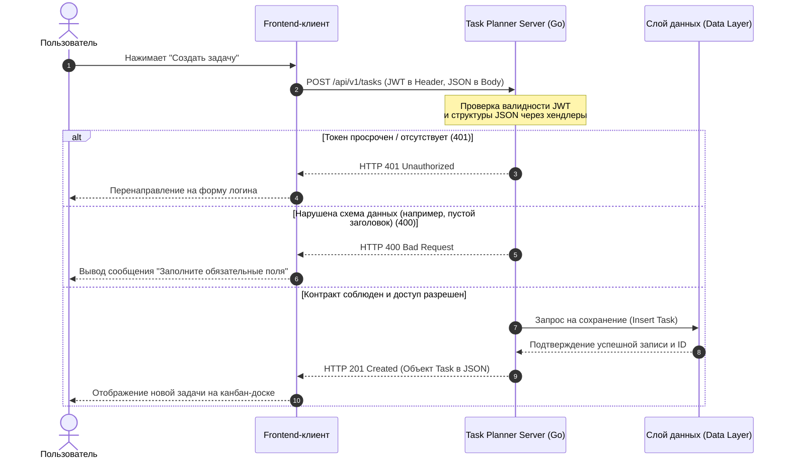

# ToDo Server — Планировщик задач

> **Роль:** системный аналитик (полный цикл: требования → модель данных → API → документация)  
> **Стек:** Go, PostgreSQL, REST/JSON, JWT, Mermaid, Docker

---

## Цель и бизнес‑ценность

Автоматизировать процесс трекинга личных задач пользователей: предоставить инструмент для планирования, где статусы прозрачны, а ошибки интеграции сведены к минимуму за счёт строгих контрактов.

**Польза для бизнеса:**
- Прозрачность статусов: все участники видят актуальный статус задачи без разночтений.
- Снижение ошибок: валидация и чёткие коды ошибок позволяют фронтенду сразу обрабатывать все сценарии.
- Контроль доступа: пользователь видит и меняет только свои задачи — снижает риски и упрощает тестирование.

---

## Требования и сценарии

### Бизнес‑требования (BRD)
- Система должна позволять пользователю управлять своими задачами (создание, просмотр, редактирование, удаление).
- Должна быть обеспечена строгая валидация входных данных до записи в БД.
- Должен быть реализован контроль доступа: пользователь видит и меняет только свои задачи.

### Пользовательские сценарии (Use Cases) с критериями приёмки

| ID | Сценарий | Описание | Критерии приёмки |
|----|----------|----------|------------------|
| UC-1 | Создание задачи | Пользователь передаёт текст задачи и дедлайн. Система валидирует данные, присваивает уникальный ID и сохраняет задачу. | `title` обязателен; `status` по умолчанию = `new`; генерируется уникальный `id`; ответ 201 Created. |
| UC-2 | Получение списка задач | Пользователь запрашивает свои задачи. Система возвращает массив актуальных задач. | Ответ 200 OK; возвращаются только задачи текущего пользователя; авторизация через JWT обязательна. |
| UC-3 | Редактирование задачи | Пользователь изменяет текст или отмечает задачу как выполнено. | Обновляются только переданные поля; нельзя сменить `id`; нельзя присвоить несуществующий статус; ответ 200 OK. |
| UC-4 | Удаление задачи | Пользователь удаляет задачу по её ID. | Ответ 204 No Content; при повторном запросе — 404; нельзя удалить чужую задачу. |

---

## 2. Системная архитектура и интеграционные потоки

Взаимодействие между клиентской (Frontend) и серверной (Backend) частями системы осуществляется асинхронно/синхронно посредством протокола **HTTP (REST API)**. 

Ниже представлена UML Sequence-диаграмма, описывающая сквозной процесс авторизации пользователя и последующего создания задачи с контролем безопасности (JWT) и валидацией JSON-payload:



---

##  Спецификация REST API (Интеграционные контракты)

* **Базовый URL:** `/api/v1`
* **Формат данных:** JSON (`application/json`)

### 1. Создание новой задачи
* **URL:** `/tasks`
* **Метод:** `POST`
* **Заголовки (Headers):** 
  * `Content-Type: application/json`
  * `Authorization: Bearer <JWT-токен>`
* **Тело запроса (Request Body):**
```json
{
  "title": "Спроектировать интеграцию со СКУД",
  "description": "Составить маппинг полей для синхронизации сотрудников",
  "priority": "high",
  "due_date": "2026-10-15T18:00:00Z"
}
```
* **Успешный ответ (Response 201 Created):**
```json
{
  "id": 854,
  "title": "Спроектировать интеграцию со СКУД",
  "description": "Составить маппинг полей для синхронизации сотрудников",
  "priority": "high",
  "status": "todo",
  "due_date": "2026-10-15T18:00:00Z",
  "created_at": "2026-10-08T10:30:00Z"
}
```
* **Ответ при ошибке валидации (Response 400 Bad Request):**
```json
{
  "error": "Bad Request",
  "message": "Ошибка валидации: поле 'title' является обязательным и не может быть пустым"
}
```

### 2. Получение списка задач пользователя
* **URL:** `/tasks`
* **Метод:** `GET`
* **Заголовки (Headers):** 
  * `Authorization: Bearer <JWT-токен>`
* **Успешный ответ (Response 200 OK):**
```json
[
  {
    "id": 854,
    "title": "Спроектировать интеграцию со СКУД",
    "status": "todo",
    "priority": "high",
    "due_date": "2026-10-15T18:00:00Z"
  }
]
```

---

## Информационная модель (Структура данных)

Для поддержания консистентности и защиты от аномалий на уровне серверного кода закреплена жесткая структура сущности **Task**:

| Системное поле | Тип данных | Обязательность | Описание |
| :--- | :--- | :--- | :--- |
| `id` | Int64 | Да (System) | Уникальный идентификатор задачи в системе |
| `title` | String | Да (User) | Краткое название (минимум 1 символ) |
| `description`| String | Нет | Развернутое техническое или бизнес-описание |
| `priority` | String (Enum) | Да | Приоритет задачи (`low`, `medium`, `high`) |
| `status` | String (Enum) | Да | Текущий этап (`todo`, `in_progress`, `done`) |
| `due_date` | Timestamp (ISO 8601) | Нет | Плановый срок завершения (дедлайн) |
| `created_at` | Timestamp (ISO 8601) | Да (System) | Системное время создания записи |

---

##  Технологический стек и обоснование решений (Tech Stack)

| Компонент / Слой | Технология | Обоснование и применённые решения |
| :--- | :--- | :--- |
| **Бэкенд** | **Go (Golang)** | Выбран благодаря встроенной конкурентности и высокой пропускной способности при минимальных затратах серверных мощностей (CPU/RAM). |
| **Архитектурный стиль**| **REST API** | Обеспечивает предсказуемые и легко масштабируемые синхронные контракты взаимодействия систем. |
| **Безопасность** | **JWT (Stateless)** | Позволяет верифицировать сессии пользователей без выполнения избыточных запросов ввода-вывода (I/O) к базе данных при каждом HTTP-вызове. |
| **Формат данных** | **JSON** | Индустриальный стандарт обмена сообщениями. Поддерживает парсинг и строгую проверку типов полей на уровне контроллеров Go. 
| **Документирование API**|  Фиксация структуры и типов данных интеграционных контрактов непосредственно в техническом описании репозитория для прозрачного онбординга разработчиков. |
| **Визуализация** | **Mermaid** | Код UML Sequence-диаграммы интегрирован непосредственно в документацию репозитория, исключая устаревание схем. |
| **Инфраструктура** | **Docker** | Контейнеризация приложения для обеспечения одинакового поведения сервиса на машинах разработки, тестирования и продакшена. |
| **Тестирование** | **Postman** | Валидация граничных значений, кодов ответов сервера и симуляция негативных пользовательских сценариев. |
